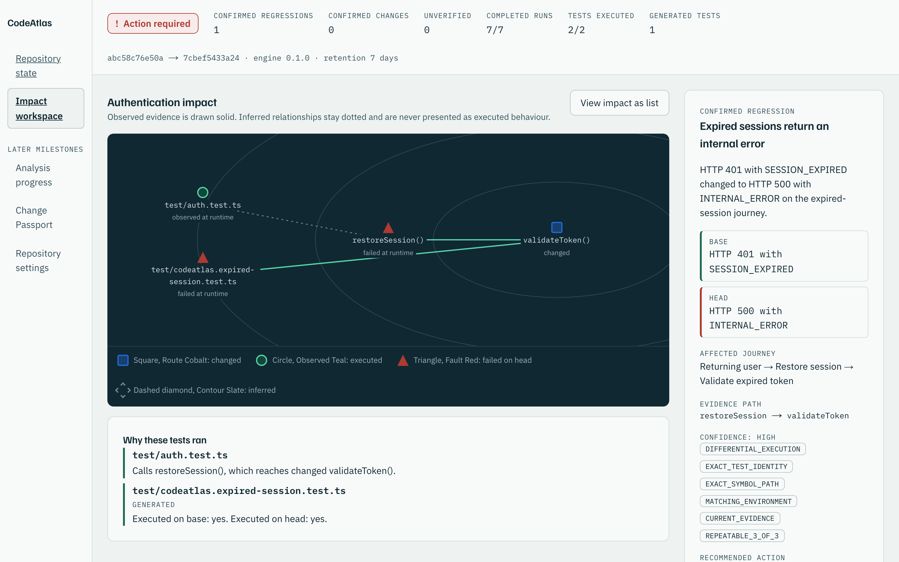
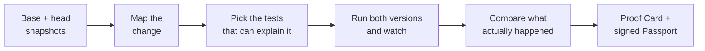

<p align="center">
  
</p>

<h1 align="center">CodeAtlas</h1>

<p align="center">
  <strong>See what your change actually broke — with proof you can re-run.</strong>
</p>

<p align="center">
  
  
  
  
</p>

---

## The short version

When you review a pull request you can read the diff. What you cannot see is
what the change **does**.

CodeAtlas runs your tests against both versions of the code, watches what
actually happens, and tells you what changed in the behaviour — not in the
text. When it finds something, it hands you a command that reproduces it on
your own machine.

It is deliberately narrow. It does not score your code, summarise your diff, or
tell you a change is safe to merge. It shows you evidence and says plainly which
parts it could not verify.

<p align="center">
  
</p>

## See it work

The repository ships a small authentication change with a bug hidden in it. The
existing test suite passes on both versions, so a normal CI run would tell you
nothing.

```bash
node apps/cli/bin/codeatlas.mjs analyze \
  --base fixtures/auth-regression/base \
  --head fixtures/auth-regression/head \
  --out .codeatlas/demo
```

```text
State: ACTION_REQUIRED
Changed symbols: validateToken (src/auth.ts)
Selected tests: test/auth.test.ts
  test/auth.test.ts: Calls restoreSession(), which reaches changed validateToken().

Generated tests:
  test/codeatlas.expired-session.test.ts (generated; executed on base: yes, head: yes)

Findings:
  [CONFIRMED_REGRESSION] Expired sessions return an internal error
    base: HTTP 401 with SESSION_EXPIRED
    head: HTTP 500 with INTERNAL_ERROR
    journey: Returning user → Restore session → Validate expired token
    replay: codeatlas replay finding_expired_session
```

Nothing in that output is inferred. The expired-session test was written because
a changed branch had no test covering it, then compiled and executed on both
revisions. The 401 and the 500 were observed.

Now reproduce it, exactly as the Proof Card says:

```bash
node apps/cli/bin/codeatlas.mjs replay finding_expired_session
```

```text
Base produced HTTP 401 with SESSION_EXPIRED; head produced HTTP 500 with INTERNAL_ERROR.
REPRODUCED finding_expired_session
```

Replay verifies every artifact digest, the manifest digest and the signature
**before it starts a single test process**. Change one byte of the evidence and
it exits without running anything.

## What you get

| Output              | What it is                                                                                                                                                     |
| ------------------- | -------------------------------------------------------------------------------------------------------------------------------------------------------------- |
| **Proof Card**      | One finding: what the base did, what the head did, which journey it affects, the exact code path, why it is confident, and what it could not check.            |
| **Change Passport** | The permanent record for the whole comparison, as JSON and Markdown, with a signed Evidence Manifest.                                                          |
| **Replay**          | One command that re-runs the recorded evidence and prints `REPRODUCED`, `NOT_REPRODUCED` or `ENVIRONMENT_MISMATCH`.                                            |
| **Workspace**       | A map of what the change touched, with runtime-confirmed routes drawn solid and inferred ones dotted — plus a list view carrying exactly the same information. |

## How it works



1. **Map the change.** Parse both snapshots and work out which symbols and
   branches actually changed. No repository code is executed at this stage.
2. **Pick the tests.** Walk the call graph back from the changed symbols to the
   tests that reach them. Every selection records a sentence explaining itself.
3. **Fill the gaps.** Where a changed branch has no test covering it, derive an
   objective and generate one narrow test for it. The generator cannot choose
   its own objective or vouch for its own output.
4. **Run both versions.** Execute the existing and generated tests on base and
   head, three times each, under time and output limits.
5. **Compare.** A regression is only confirmed when the test compiled, both
   sides ran in matching environments, base passed, head failed with a real
   behavioural difference, and the result repeated. Anything else is reported as
   `UNVERIFIED` with the reason.
6. **Sign it.** Canonicalise the evidence, sign it with Ed25519, and write a
   reproduction bundle.

## What is actually built

Everything below runs locally, against local snapshots.

| Capability                                             | Status    |
| ------------------------------------------------------ | --------- |
| Evidence, finding, Passport and manifest schemas       | Working   |
| Canonical SHA-256 + Ed25519 manifest signing           | Working   |
| TypeScript/JavaScript snapshot analysis (no execution) | Working   |
| Changed-line, symbol, call, export and test mapping    | Working   |
| Explainable test selection                             | Working   |
| Bounded local test execution (**trusted code only**)   | Working   |
| Generated regression tests and differential findings   | Working   |
| Change Passport, CLI and replay                        | Working   |
| Forensic Cartography workspace                         | Working   |
| Hosted app, sign-in, Firebase control plane            | Not built |
| gVisor sandbox for untrusted repositories              | Not built |
| GitHub App for public/private repositories             | Not built |

There is no hosted service, no GitHub App and no sandbox for untrusted code.
Those are separate milestones and this README will not claim them until they
exist.

## The rules it follows

- **What was observed beats what was guessed.** Static analysis points you at
  suspects. Only repeatable execution on both versions can confirm a regression.
- **AI is optional.** Mapping, selection, execution, comparison, signing and
  replay all work with it switched off.
- **Every citation is pinned.** Source locations carry a snapshot digest, never
  a branch name that can move underneath them.
- **Generated tests cannot vouch for themselves.** They have to compile, run on
  both versions, and stay labelled as generated.
- **Unknown stays unknown.** Missing, malformed or contradictory evidence
  becomes `UNVERIFIED`. It never gets rounded up into a confidence percentage.
- **Boundaries are described honestly.** Local process containment is not a
  sandbox, and this project does not pretend otherwise.

## Setup

You need Node.js 24.18 or newer (below 27) and pnpm 11.9.0, on macOS or Linux.
Windows execution fails closed until a real process-tree boundary exists.

```bash
git clone https://github.com/yeegz/CodeAtlas.git
cd CodeAtlas
git checkout codex/codeatlas-evidence-core
corepack enable
pnpm install --frozen-lockfile
```

Node 25 and newer no longer bundle Corepack. If `corepack enable` is not
available, install the pinned package manager directly:

```bash
npm install -g pnpm@11.9.0
```

Acceptance tests drive a real browser, so install it once:

```bash
pnpm exec playwright install chromium
```

Then run the whole gate — formatting, lint, types, every test, the CLI and
browser acceptance suites, and a production build:

```bash
pnpm verify
```

It takes around twenty minutes. That is not overhead: the suites execute the
fixture test suites for real, on both revisions, in child processes.

To open the workspace yourself:

```bash
pnpm --filter @codeatlas/web dev
```

That script sets `CODEATLAS_DEMO_MODE=true`. Without it, the demo endpoint
returns 404 and the workspace offers no way to execute anything.

## Before you point it at someone else's code

**Don't.** Running an analysis executes the repository's test suite as your user,
with your filesystem and your network.

The local runner copies the snapshot to a temporary directory, rejects symlinks
that escape it, spawns processes with argument arrays and no shell, strips the
environment, caps time and output, and cleans up afterwards. That reduces
accidental damage. It is **not** a security boundary and will not stop code that
is trying to get out.

Untrusted repositories are the job of the gVisor sandbox in a later milestone.
The full boundary, including what the local signing key does and does not prove,
is written up in
[docs/security/local-execution-boundary.md](docs/security/local-execution-boundary.md).
To report a vulnerability, see [SECURITY.md](SECURITY.md).

## Documentation

| Document                                                                                           | What it covers                                                       |
| -------------------------------------------------------------------------------------------------- | -------------------------------------------------------------------- |
| [Architecture](docs/architecture/evidence-core.md)                                                 | Package graph, orchestration order, replaceable boundaries           |
| [Local execution boundary](docs/security/local-execution-boundary.md)                              | What is and is not contained, and the trust model of the signing key |
| [Evidence Manifest v1](docs/evidence-manifest-v1.md)                                               | Manifest fields, canonicalisation, and how to verify one yourself    |
| [Product design](docs/superpowers/specs/2026-07-29-codeatlas-product-design.md)                    | The approved specification                                           |
| [Implementation plan](docs/superpowers/plans/2026-07-29-codeatlas-evidence-core-vertical-slice.md) | The task-level plan this milestone followed                          |

## Contributing

CodeAtlas is built test-first, in focused commits, with a review gate per task.
Read [CONTRIBUTING.md](CONTRIBUTING.md) first.

One request above all others: **do not describe unbuilt capability as shipped.**
The whole point of this project is that its claims can be checked.
