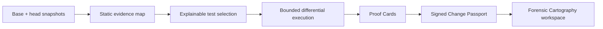

# CodeAtlas

**Evidence for what a code change actually does.**

CodeAtlas is an evidence-first change intelligence system for TypeScript and JavaScript repositories. It maps a change through the codebase, selects the tests that can explain its impact, compares behavior across base and head revisions, and packages the result into a signed Change Passport.

Instead of another opaque score or AI-authored review summary, CodeAtlas is designed around inspectable claims: immutable source citations, static graph paths, observed runtime behavior, reproducible commands, explicit limitations, and cryptographically verifiable manifests.

> [!IMPORTANT]
> CodeAtlas is under active development. It is not yet a hosted service, GitHub App, or production sandbox. The current implementation lives on [`codex/codeatlas-evidence-core`](https://github.com/yeegz/CodeAtlas/tree/codex/codeatlas-evidence-core), and its local runner must only be used with repositories you trust.

## What CodeAtlas is building



A completed analysis should answer five practical questions:

1. What changed at the symbol and branch level?
2. Which journeys and tests are connected to it, and why?
3. What behavior was observed on the base and head revisions?
4. Which claims are confirmed, probable, possible, or still unverified?
5. Can another developer reproduce and verify the evidence independently?

## Current implementation status

| Capability                                               | Status                         |
| -------------------------------------------------------- | ------------------------------ |
| Strict evidence, finding, Passport, and manifest schemas | Review complete                |
| Canonical SHA-256 + Ed25519 manifest signing             | Review complete                |
| Non-executing TypeScript/JavaScript snapshot analysis    | Review complete                |
| Changed-line, symbol, call, export, and test mapping     | Review complete                |
| Deterministic, explainable test selection                | Review complete                |
| Bounded local Vitest execution                           | Security hardening in progress |
| Generated regression tests and differential findings     | Next                           |
| Change Passport pipeline, CLI, and replay                | Planned in this milestone      |
| Forensic Cartography web workspace                       | Planned in this milestone      |
| Firebase control plane and hosting                       | Later production milestone     |
| GKE Autopilot + gVisor hostile-code sandbox              | Later production milestone     |
| GitHub App for public/private repositories               | Later production milestone     |

The development branch currently includes committed RED tests for the next runner hardening pass. That is an intentional pause point, not a green release tag.

## Design principles

- **Observed evidence outranks inference.** Static analysis and AI suggestions can guide investigation, but only repeatable base/head execution can confirm a regression.
- **AI is optional.** Core mapping, selection, execution, comparison, signing, and replay remain useful with AI disabled.
- **Every citation is immutable.** Source locations carry a snapshot digest and a repository-relative path.
- **Generated tests cannot certify themselves.** They must execute on both revisions and be corroborated by independent evidence.
- **Unknown means unknown.** Missing, malformed, timed-out, or contradictory evidence becomes `UNVERIFIED`; it is never converted into a confidence percentage.
- **Security boundaries are named honestly.** Local process containment is not presented as a hostile-code sandbox.

## Repository layout

```text
packages/
  evidence/   Validated evidence, findings, Passports, and signed manifests
  analyzer/   Static snapshot mapping and content-addressed change analysis
  selector/   Deterministic graph-based test selection and explanations
  runner/     Bounded trusted-local Vitest execution (in hardening)
fixtures/
  auth-regression/  Base/head snapshots with an intentionally hidden regression
docs/superpowers/
  specs/      Approved product and architecture specification
  plans/      Task-level Evidence Core implementation plan
```

Generator, differential, Passport pipeline, CLI, and web packages will land as the vertical slice progresses.

## Development setup

Requirements:

- Node.js `24.18.0` or newer within the declared `<27` range
- pnpm `11.9.0`
- macOS or Linux for the current trusted-local runner; Windows execution fails closed until a real process-tree boundary is implemented

```bash
git clone https://github.com/yeegz/CodeAtlas.git
cd CodeAtlas
git checkout codex/codeatlas-evidence-core
corepack enable
pnpm install --frozen-lockfile
```

Run the review-complete core packages:

```bash
pnpm vitest run packages/evidence/test packages/analyzer/test packages/selector/test
pnpm typecheck
pnpm lint
```

The full runner suite is intentionally RED at the current pause commit while the next security invariants are implemented. See the implementation plan and branch history before treating a failure as a regression.

## Security boundary

The current `LocalExecutionProvider` copies a snapshot into a temporary directory, validates paths, limits time/output/file count, minimizes the child environment, invokes executables without shell interpolation, and removes the temporary run directory. It still executes repository code as the host user.

**Do not use the local provider with untrusted third-party repositories.** Hosted third-party execution will not ship until the GKE Autopilot + gVisor sandbox, source broker, egress policy, quotas, and adversarial acceptance tests are complete.

For vulnerability reporting, see [SECURITY.md](SECURITY.md).

## Product direction

The interface is called **Forensic Cartography**: a calm, map-first workspace where changed nodes, observed runtime paths, inferred edges, failures, evidence, and limitations remain visually distinct. The design avoids decorative dashboards, fake confidence metrics, glassmorphism, and unsupported “safe to merge” claims.

The approved architecture and visual/product decisions are documented in [`docs/superpowers/specs/2026-07-29-codeatlas-product-design.md`](docs/superpowers/specs/2026-07-29-codeatlas-product-design.md). The active vertical-slice plan is in [`docs/superpowers/plans/2026-07-29-codeatlas-evidence-core-vertical-slice.md`](docs/superpowers/plans/2026-07-29-codeatlas-evidence-core-vertical-slice.md).

## Contributing

CodeAtlas is being built test-first with focused commits and task-level review gates. Read [CONTRIBUTING.md](CONTRIBUTING.md) before opening a change. Please do not describe incomplete hosted, private-repository, Firebase, or GKE capabilities as shipped.
