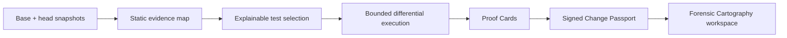

# CodeAtlas

**Evidence for what a code change actually does.**

CodeAtlas is an evidence-first change intelligence system for TypeScript and JavaScript repositories. It maps a change through the codebase, selects the tests that can explain its impact, compares behavior across base and head revisions, and packages the result into a signed Change Passport.

Instead of another opaque score or AI-authored review summary, CodeAtlas is designed around inspectable claims: immutable source citations, static graph paths, observed runtime behavior, reproducible commands, explicit limitations, and cryptographically verifiable manifests.

> [!IMPORTANT]
> CodeAtlas is under active development. It is not yet a hosted service, GitHub App, or production sandbox. The local evidence core is complete and green on [`codex/codeatlas-evidence-core`](https://github.com/yeegz/CodeAtlas/tree/codex/codeatlas-evidence-core), and its local runner must only be used with repositories you trust.

## What CodeAtlas is building



A completed analysis should answer five practical questions:

1. What changed at the symbol and branch level?
2. Which journeys and tests are connected to it, and why?
3. What behavior was observed on the base and head revisions?
4. Which claims are confirmed, probable, possible, or still unverified?
5. Can another developer reproduce and verify the evidence independently?

## Try it

Analyse the seeded authentication comparison and replay the finding it proves:

```bash
node apps/cli/bin/codeatlas.mjs analyze --base fixtures/auth-regression/base --head fixtures/auth-regression/head --out .codeatlas/demo
```

The command exits `2` for `ACTION_REQUIRED` and reports one confirmed
regression: expired sessions return `HTTP 401 with SESSION_EXPIRED` on base and
`HTTP 500 with INTERNAL_ERROR` on head. The Proof Card prints its own
reproduction command, which works from the repository root:

```bash
node apps/cli/bin/codeatlas.mjs replay finding_expired_session
```

That verifies every artifact digest, the manifest digest and the manifest
signature before starting any test process, re-executes the recorded generated
test on both revisions, and prints `REPRODUCED finding_expired_session`.

The same analysis renders in the workspace:

```bash
pnpm --filter @codeatlas/web dev
```

## Current implementation status

| Capability                                               | Status                     |
| -------------------------------------------------------- | -------------------------- |
| Strict evidence, finding, Passport, and manifest schemas | Complete                   |
| Canonical SHA-256 + Ed25519 manifest signing             | Complete                   |
| Non-executing TypeScript/JavaScript snapshot analysis    | Complete                   |
| Changed-line, symbol, call, export, and test mapping     | Complete                   |
| Deterministic, explainable test selection                | Complete                   |
| Bounded local Vitest execution                           | Complete (trusted code)    |
| Generated regression tests and differential findings     | Complete                   |
| Change Passport pipeline, CLI, and replay                | Complete                   |
| Forensic Cartography web workspace                       | Complete                   |
| Firebase control plane and hosting                       | Later production milestone |
| GKE Autopilot + gVisor hostile-code sandbox              | Later production milestone |
| GitHub App for public/private repositories               | Later production milestone |

Everything marked complete runs locally against local snapshots. No hosted, private-repository, Firebase, or GKE capability exists yet.

## Design principles

- **Observed evidence outranks inference.** Static analysis and AI suggestions can guide investigation, but only repeatable base/head execution can confirm a regression.
- **AI is optional.** Core mapping, selection, execution, comparison, signing, and replay remain useful with AI disabled.
- **Every citation is immutable.** Source locations carry a snapshot digest and a repository-relative path.
- **Generated tests cannot certify themselves.** They must execute on both revisions and be corroborated by independent evidence.
- **Unknown means unknown.** Missing, malformed, timed-out, or contradictory evidence becomes `UNVERIFIED`; it is never converted into a confidence percentage.
- **Security boundaries are named honestly.** Local process containment is not presented as a hostile-code sandbox.

## Repository layout

```text
packages/
  evidence/      Validated evidence, findings, Passports, and signed manifests
  analyzer/      Static snapshot mapping and content-addressed change analysis
  selector/      Deterministic graph-based test selection and explanations
  runner/        Bounded trusted-local Vitest execution
  generator/     Evidence-targeted objectives and the narrow template generator
  differential/  Base/head comparison and evidence-eligibility rules
  passport/      Change Passport assembly and JSON/Markdown export
  pipeline/      End-to-end orchestration and the content-addressed artifact store
apps/
  cli/           `codeatlas analyze` and `codeatlas replay`
  web/           The Forensic Cartography workspace
fixtures/
  auth-regression/  Base/head snapshots with an intentionally hidden regression
test/e2e/        CLI and browser acceptance tests
docs/
  architecture/  Evidence core architecture
  security/      The local execution boundary
  superpowers/   Approved specification and the task-level plan
```

## Development setup

Requirements:

- Node.js `24.18.0` or newer within the declared `<27` range
- pnpm `11.9.0`
- macOS or Linux for the current trusted-local runner; Windows execution fails closed until a real process-tree boundary is implemented

```bash
git clone https://github.com/yeegz/CodeAtlas.git
cd CodeAtlas
git checkout codex/codeatlas-evidence-core
corepack enable
pnpm install --frozen-lockfile
```

Node 25 and newer no longer bundle Corepack. If `corepack enable` is unavailable, install the pinned package manager directly with `npm install -g pnpm@11.9.0`.

Acceptance tests drive a real browser, so install it once:

```bash
pnpm exec playwright install chromium
```

Then run everything:

```bash
pnpm verify
```

`verify` runs formatting, lint, types, the unit and integration suites, the CLI and browser acceptance tests, and a production web build. The suites execute the fixture tests for real on both revisions, so a full run takes several minutes.

To explore the workspace, start the app in demo mode:

```bash
pnpm --filter @codeatlas/web dev
```

The `dev` script sets `CODEATLAS_DEMO_MODE=true`. Without it, `POST /api/demo` returns 404 and the workspace offers no way to execute repository code.

## Security boundary

`LocalExecutionProvider` copies a snapshot into a temporary directory, validates paths, limits time/output/file count, minimizes the child environment, invokes executables without shell interpolation, and removes the temporary run directory. It still executes repository code as the host user.

**Do not use the local provider with untrusted third-party repositories.** Hosted third-party execution will not ship until the GKE Autopilot + gVisor sandbox, source broker, egress policy, quotas, and adversarial acceptance tests are complete.

The full boundary, including what the local signing key does and does not prove, is documented in [docs/security/local-execution-boundary.md](docs/security/local-execution-boundary.md). For vulnerability reporting, see [SECURITY.md](SECURITY.md).

## Documentation

- [Evidence core architecture](docs/architecture/evidence-core.md)
- [The local execution boundary](docs/security/local-execution-boundary.md)
- [Evidence Manifest v1](docs/evidence-manifest-v1.md)
- [Product design specification](docs/superpowers/specs/2026-07-29-codeatlas-product-design.md)
- [Evidence core implementation plan](docs/superpowers/plans/2026-07-29-codeatlas-evidence-core-vertical-slice.md)

## Product direction

The interface is called **Forensic Cartography**: a calm, map-first workspace where changed nodes, observed runtime paths, inferred edges, failures, evidence, and limitations remain visually distinct. The design avoids decorative dashboards, fake confidence metrics, glassmorphism, and unsupported “safe to merge” claims.

## Contributing

CodeAtlas is being built test-first with focused commits and task-level review gates. Read [CONTRIBUTING.md](CONTRIBUTING.md) before opening a change. Please do not describe incomplete hosted, private-repository, Firebase, or GKE capabilities as shipped.
